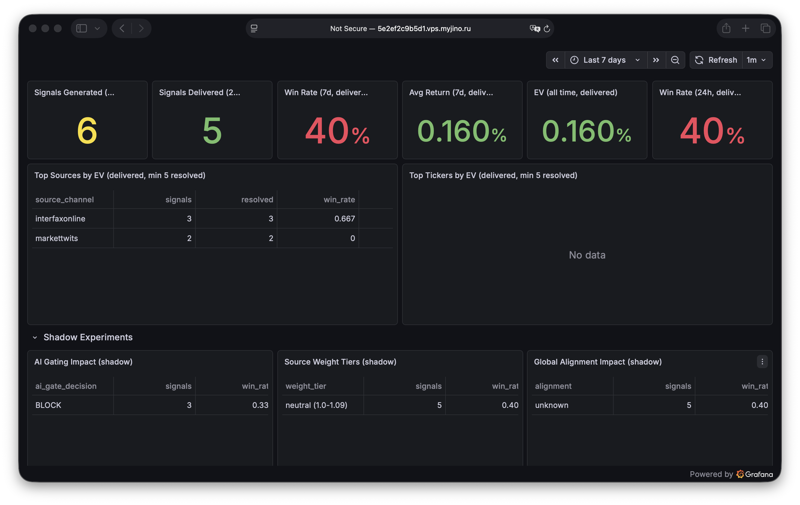
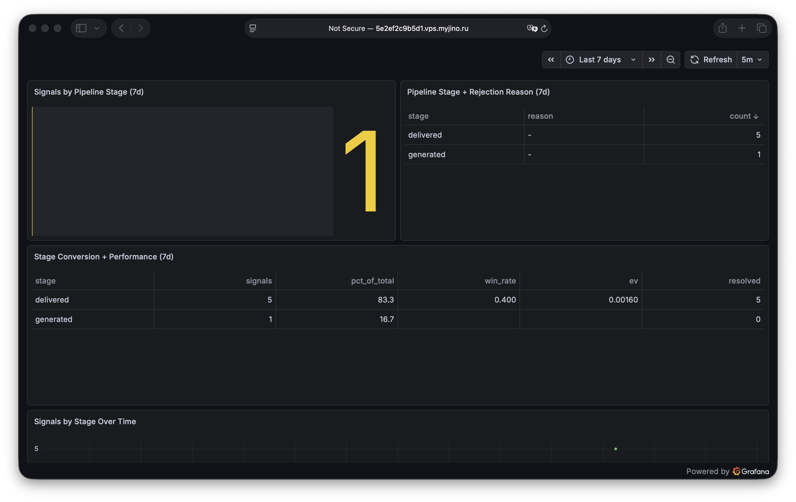
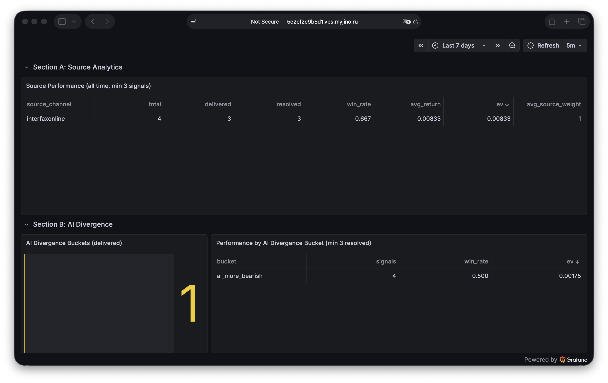
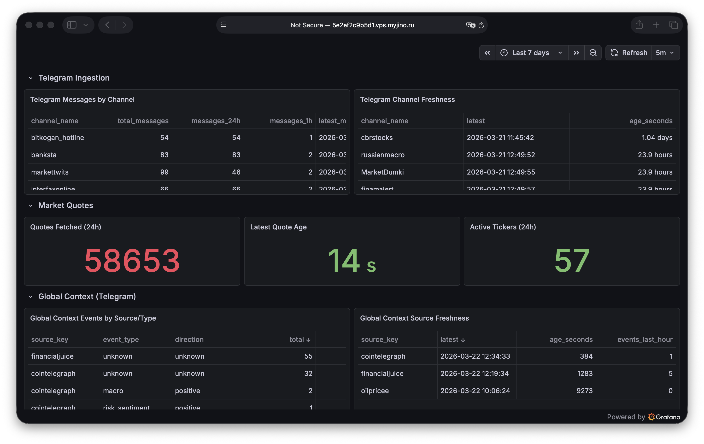

# Grafana Dashboards

Guide to the 11 Grafana dashboards that provide observability into the T-Invest-trader platform.

## Overview

Dashboards are organized into four tiers by purpose:

| Tier | Dashboard | When to Use |
|------|-----------|-------------|
| Operator | **Operator Overview** | Daily check -- is the system healthy and performing? |
| Pipeline | **Signal Pipeline Funnel** | Where are signals being lost? |
| Analytics | **Analytics: AI / Source / Global** | Are shadow experiments adding value? |
| Infrastructure | **Data & Infra Health** | Debugging ingestion failures and data staleness |

Supporting dashboards provide deeper views into individual data sources:

| Dashboard | Scope |
|-----------|-------|
| Telegram Sentiment | Per-channel message and sentiment stats |
| Signal Observations | Time-window sentiment aggregation |
| Broker Events | Dividend, report, insider deal ingestion |
| Fused Signal Features | Combined sentiment + broker metrics |
| CBR Events | Central Bank macro event timeline |
| MOEX Market History | Moscow Exchange price and volume data |
| Combined Overview | Legacy high-level signal stats |

All dashboards query PostgreSQL directly using the provisioned Grafana datasource.

---

## Dashboard: Operator Overview

**Purpose:** Single-screen operational health check. Start here every day.

**When to use:** Morning check, after deployments, or when you receive an alert.

### Panels

| Panel | What It Shows |
|-------|--------------|
| Signals Generated (24h) | Total signals created in the last 24 hours |
| Signals Delivered (24h) | Signals that passed all gates and were sent to Telegram |
| Win Rate (7d, delivered) | 7-day rolling win rate for delivered signals |
| Win Rate (24h, delivered) | Last 24h win rate (more volatile, shows recent trend) |
| Avg Return (7d, delivered) | Average return percentage over 7 days |
| EV (all time, delivered) | Expected value across all resolved delivered signals |
| Top Sources by EV | Best-performing Telegram channels (min 5 resolved) |
| Top Tickers by EV | Best-performing instruments (min 5 resolved) |
| AI Gating Impact (shadow) | ALLOW vs CAUTION vs BLOCK outcome comparison |
| Source Weight Tiers (shadow) | Performance by source weight bucket |
| Global Alignment Impact (shadow) | Win rate for aligned vs against vs neutral signals |

### What to Look For

- **Delivery ratio** -- if generated >> delivered, check the funnel dashboard for rejection breakdown
- **Win rate trend** -- compare 24h vs 7d. Sudden drops may indicate a regime change or data issue
- **EV sign** -- positive EV means the system is net profitable. Negative EV over sustained periods warrants investigation
- **Shadow panels** -- look for consistent deltas between experiment groups. Large positive deltas suggest the feature is ready for promotion
- **Top sources** -- sources with negative EV may need to be removed or down-weighted



---

## Dashboard: Signal Pipeline Funnel

**Purpose:** Visualize signal flow through decision gates. Understand where and why signals are rejected.

**When to use:** When delivery volume drops, or to evaluate calibration thresholds.

### Panels

| Panel | What It Shows |
|-------|--------------|
| Signals by Pipeline Stage (7d) | Count per stage: generated, rejected_calibration, rejected_binding, rejected_safety, delivered |
| Pipeline Stage + Rejection Reason (7d) | Breakdown of rejection reasons within each rejection stage |
| Stage Conversion + Performance (7d) | Win rate and avg return for signals at each stage (including rejected ones) |
| Signals by Stage Over Time | Time series of stage counts to spot trends |

### Key Insights

- **Calibration rejections** -- high rejection rate with `low_confidence` is expected. High rejection rate with `negative_ev` means the system is correctly filtering unprofitable signals. If rejected signals have higher win rates than delivered ones, thresholds may be too aggressive.
- **Binding rejections** -- usually `no_match` (ticker not in instrument catalog) or `ambiguous` (multiple candidates). High binding rejection rates mean the instrument catalog needs updating.
- **Safety rejections** -- `market_closed` and `too_late_to_execute` are normal outside trading hours. High safety rejections during market hours indicate a timing issue.
- **Edge leakage** -- the Stage Conversion panel shows performance of rejected signals. If rejected signals would have been profitable, the rejection criteria may be too strict.



---

## Dashboard: Analytics: AI / Source / Global

**Purpose:** Evaluate whether shadow experiments and enrichment layers add predictive value.

**When to use:** Weekly review of experiment performance, or before promoting a shadow feature to active.

### Source Performance

| Panel | What It Shows |
|-------|--------------|
| Source Performance | Win rate, EV, and signal count per Telegram source channel (min 3 signals) |

**How to interpret:** Sources with consistently positive EV and high win rate are reliable. Sources with negative EV over many signals should be considered for removal or down-weighting.

### AI Divergence

| Panel | What It Shows |
|-------|--------------|
| AI Divergence Buckets | Distribution of agreement between system severity and AI confidence |
| Performance by AI Divergence Bucket | Win rate and return per divergence bucket (min 3 resolved) |

**Divergence buckets:**

- `agree_strong` -- both system and AI rate signal as HIGH or both as LOW
- `agree_weak` -- both rate as MEDIUM
- `ai_more_bullish` -- AI rates higher than system
- `ai_more_bearish` -- AI rates lower than system
- `uncertain` -- mixed or incomplete data

**How to interpret:** If `agree_strong` signals significantly outperform `ai_more_bearish` signals, AI divergence has predictive value. If there's no difference across buckets, AI analysis is not adding edge.

### AI Gating

| Panel | What It Shows |
|-------|--------------|
| AI Gating: Baseline vs Filtered | Compares performance of ALLOW vs BLOCK signals (shadow mode) |

**How to interpret:** If ALLOW signals consistently outperform BLOCK signals, AI gating is ready for promotion. The delta size indicates the potential improvement from enabling gating.

### Global Context Alignment

| Panel | What It Shows |
|-------|--------------|
| Global Alignment: Performance by Alignment | Win rate for signals aligned with, against, or neutral to global context |

**How to interpret:** If `aligned` signals outperform `against` signals, global context adds value. If no difference, the macro context is not predictive for the current signal set.



---

## Dashboard: Data & Infra Health

**Purpose:** Monitor data freshness and system health. Detect ingestion failures before they affect signal quality.

**When to use:** When debugging alerts, after infrastructure changes, or when signal quality degrades unexpectedly.

### Panels

| Panel | What It Shows |
|-------|--------------|
| Telegram Messages by Channel | Message ingestion volume per Telegram channel |
| Telegram Channel Freshness | Time since last message per channel |
| Quotes Fetched (24h) | Number of quote sync operations |
| Latest Quote Age | Time since last quote for each tracked instrument |
| Active Tickers (24h) | Number of unique tickers with recent quotes |
| Global Context Events by Source/Type | Event counts by source channel and event type |
| Global Context Source Freshness | Time since last event per global source |
| Latest Global Market Snapshots | Most recent prices for tracked indices/commodities |
| Broker Fetch State by Event Type | Fetch policy state (last fetch time, TTL status) |
| Broker Fetch Errors (top 20) | Most frequent fetch errors and failure counts |
| AI Analyses (total) | Total AI analysis count |
| AI Analyses (24h) | Recent AI analysis activity |
| AI Coverage (delivered) | Percentage of delivered signals with AI analysis |
| Signals Pending Resolution | Unresolved signals awaiting outcome determination |

### What to Look For

- **Stale channels** -- if a Telegram channel hasn't produced messages in >2x its expected frequency, the Telethon session may need reconnection
- **Quote age** -- quotes older than 5 minutes during market hours indicate a sync failure
- **Global context gaps** -- missing events from financialjuice or oilprice may mean the source channel changed its posting pattern
- **Broker fetch errors** -- consecutive failures trigger cooldown. High error counts may indicate API rate limiting or auth issues
- **Pending resolution count** -- should decrease over time. Growing backlog means outcome resolution is failing (likely missing quotes)



---

## How to Use Dashboards

### Daily Routine

1. **Start with Operator Overview** -- check signal counts, win rate, EV. If everything looks normal, you're done.
2. **If metrics look off** -- go to Pipeline Funnel to see where signals are being lost.
3. **If data seems stale** -- check Data & Infra Health for ingestion failures.
4. **Weekly** -- review Analytics dashboard for shadow experiment trends.

### Debugging Flow

```
Alert received
  -> Check Operator Overview (is the system producing signals?)
    -> If no signals: check Data & Infra Health (is data flowing?)
      -> If data is stale: check Telegram/quote freshness panels
      -> If data is fresh: check Pipeline Funnel (are signals being rejected?)
    -> If signals but poor performance: check Analytics (has a source degraded?)
```

### Time Range

- Use **24h** for operational checks
- Use **7d** for trend analysis
- Use **30d** for experiment evaluation

---

## Adding Dashboard Screenshots

Screenshots should be placed in `docs/images/` with descriptive filenames.

### Filenames

| Dashboard | Filename |
|-----------|----------|
| Operator Overview | `operator_overview.png` |
| Signal Pipeline Funnel | `signal_pipeline_funnel.png` |
| Analytics | `analytics.png` |
| Data & Infra Health | `data_infra_health.png` |

### Embedding

```markdown

```

### Taking Screenshots

1. Open the dashboard in Grafana (port 3000)
2. Set the time range to a representative period (e.g., 7 days)
3. Use browser screenshot or Grafana's built-in snapshot feature
4. Crop to show relevant panels
5. Save to `docs/images/` and commit
